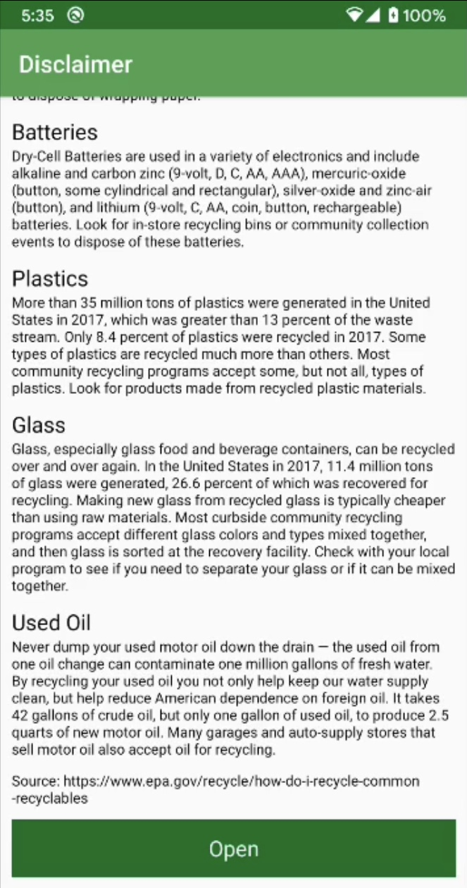
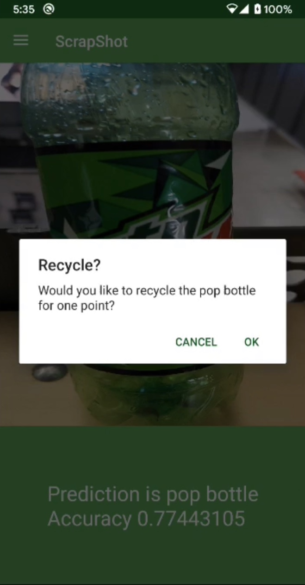
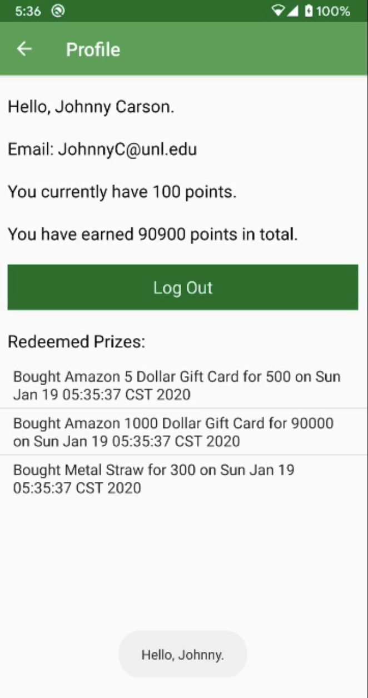
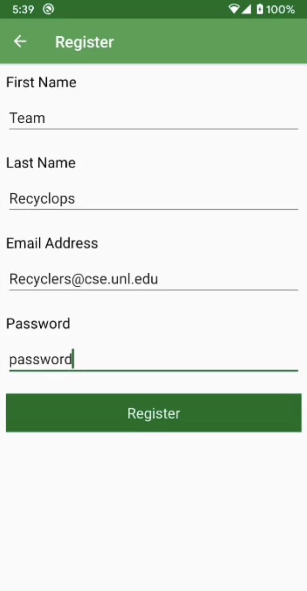
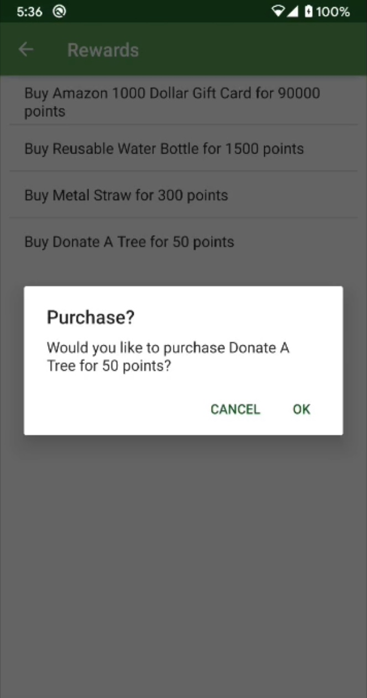
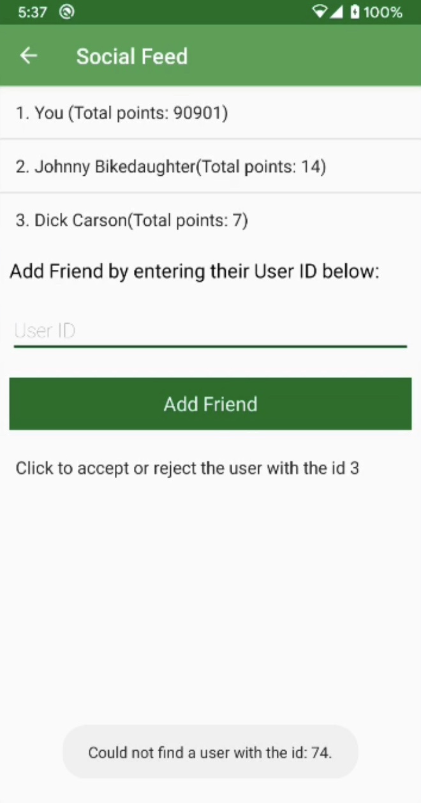
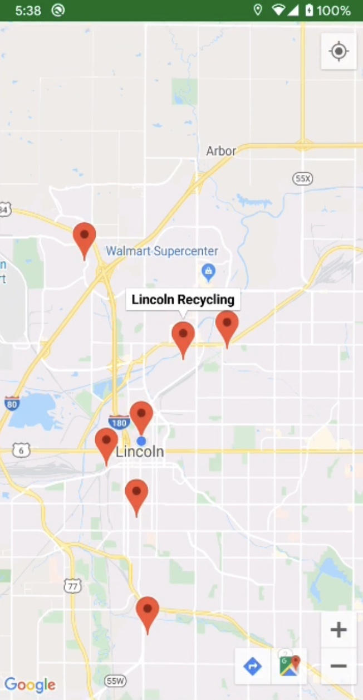

# ScrapShot

#### Winner of the Green Track at Corn Hacks 2020

##### Created by Tommy Braccia, Danny Tran, Erik Skoog, and Emma Hubka

## Inspiration

 As the world continues to advance technologically, socially, and economically, we become more and more dependent on items such as plastics, chemicals, and other pollutants. Most of these items end up in landfills, wild habitats, or even worse, back onto city streets. However, this does not need to be the case. We were inspired to make ScrapShot because we wanted to spread awareness by encouraging recycling. Often times we find ourselves asking if we can recycle certain items. By creating an informative application, we can aid people to reduce environmental, energy consumption, and waste. 

## What it does

 Our app determines whether or not an item is recyclable based on live image recognition. The user earns points for each item scanned. Once the user collects enough points, they can enter a raffle of their choosing. They can also add friends and compete to earn the most points. The app also has a map of recycling plants in the area to help the user locate where they can recycle their items. 

## How we built it

We used Kotlin, XML, Google Maps API, TensorFlowLite API, and Android Studio to develop the app.

## Challenges we ran into
* While planning this project, we knew we wanted to use GitHub, a version control system we had all used before, to efficiently separate and manage our codebase. To further encourage the separation of tasks, we decided to utilize branches. We had never used branches before, so we ran into plenty of challenges such as merge conflict and losing commits in other branches.
* Another challenge we had to overcome was to maintain consistent communication throughout an agile environment with a short time frame.

## Accomplishments that we're proud of
* As we implemented our recycling center locator, we learned a lot about geolocation concepts such as GeoJSON files and georeferencing APIs (such as Google Maps and Mapbox).
* With limited experience working with XML, we were able to add upon our knowledge by discovering different shortcuts and optimal ways to refactor our codebase. Thus, in turn, it made our codebase more concise, reduce DRY violations, and improved other software principles such as readability, maintainability, and cohesion. 
*We are proud of circumventing the issue of only being able to store strings or integers to android shared preferences by converting the objects we needed to JSON strings, storing them, and then parsing the JSON later.

## What we learned
* We learned how to create an Android app from scratch.
* We learned how to implement different types of APIs.
* We learned how to implement multiple APIs on the same project and have them work together.
* We learned XML.

## What's next for ScrapShot
* Implement a lottery system for determining how many points the user gets for scanning an item to entice the user to scan more items. 
* Add a daily bonus so users get points for interacting with the app daily. 
* Add limitations on how many points the user can earn a day to prevent people from cheating the system. 

## App Flow Demonstated by a movie and screenshots
[Link to a video demonstrating use of ScrapShot](https://github.com/Bracciata/CornHacks2020/blob/master/Demo/Demo%20Video.MOV)

When opening the application you see a disclaimer on recycling:

After that the camera classification model opens and if it recognizes a recyclable item it offers you to recycle it for points: 

In order to get points you will need to have a profile like the one shown: 

Do not worry if you do not have an account because you will be able to register: 

What is the point of getting points if you can not do anything with them? We have many rewards for users to redeem in order to keep them recycling:

Maybe you don't care about the trophy but want to win because of pride. Use the leaderboard to prove you are better at recycling than your friends:

There is also a map of recycling plants nearby you: 

